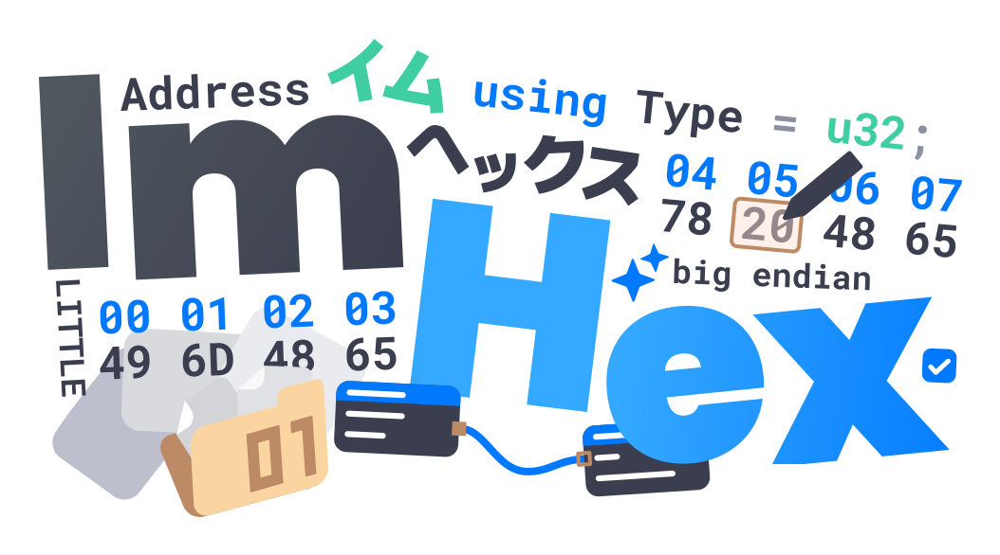

<a href="https://imhex.werwolv.net">
  <h1 align="center">
    <picture>
      
    </picture>
  </h1>
</a>

    A Hex Editor for Reverse Engineers, Programmers and people who value their retinas when working at 3 AM.
     
    <a href="https://itinerarium.github.io/phoneme-synthesis/?w=/'ˈɪmhɛks/"><strong>/ˈɪmhɛks/</strong></a>

  
  
  
  
  
  

  
  
  
  

## Supporting

If you like my work, please consider supporting me on GitHub Sponsors, Patreon or PayPal. Thanks a lot!

## Screenshots

<strong>More Screenshots</strong>

## Features

  
<strong>Featureful hex view</strong>

  - Byte patching
  - Patch management
  - Infinite Undo/Redo
  - "Copy bytes as..."
    - Bytes
    - Hex string
    - C, C++, C#, Rust, Python, Java & JavaScript array
    - ASCII-Art hex view
    - HTML self-contained div
  - Simple string and hex search
  - Goto from start, end and current cursor position
  - Colorful highlighting
    - Configurable foreground highlighting rules
    - Background highlighting using patterns, find results and bookmarks
  - Displaying data as a list of many different types
    - Hexadecimal integers (8, 16, 32, 64 bit)
    - Signed and unsigned decimal integers (8, 16, 32, 64 bit)
    - Floats (16, 32, 64 bit)
    - RGBA8 Colors
    - HexII
    - Binary
  - Decoding data as ASCII and custom encodings
    - Built-in support for UTF-8, UTF-16, ShiftJIS, most Windows encodings and many more
  - Paged data view

  
<strong>Custom C++-like pattern language for parsing highlighting a file's content</strong>

  
  - Automatic loading based on MIME types and magic values
  - Arrays, pointers, structs, unions, enums, bitfields, namespaces, little and big endian support, conditionals and much more!
  - Useful error messages, syntax highlighting and error marking
  - Support for visualizing many different types of data
    - Images
    - Audio
    - 3D Models
    - Coordinates
    - Time stamps

  
<strong>Theming support</strong>

  - Doesn't burn out your retinas when used in late-night sessions
    - Dark mode by default, but a light mode is available as well
  - Customizable colors and styles for all UI elements through shareable theme files
  - Support for custom fonts

  
<strong>Importing and Exporting data</strong>

  
  - Base64 files
  - IPS and IPS32 patches
  - Markdown reports

  
<strong>Data Inspector</strong>

  - Interpreting data as many different types with endianness, decimal, hexadecimal and octal support and bit inversion
    - Unsigned and signed integers (8, 16, 24, 32, 48, 64 bit)
    - Floats (16, 32, 64 bit)
    - Signed and Unsigned LEB128
    - ASCII, Wide and UTF-8 characters and strings
    - time32_t, time64_t, DOS date and time
    - GUIDs
    - RGBA8 and RGB65 Colors
  - Copying and modifying bytes through the inspector
  - Adding new data types through the pattern language
  - Support for hiding rows that aren't used

  
<strong>Node-based data pre-processor</strong>

  - Modify, decrypt and decode data before it's being displayed in the hex editor
  - Modify data without touching the underlying source
  - Support for adding custom nodes

  
<strong>Loading data from many different data sources</strong>

  - Local Files
    - Support for huge files with fast and efficient loading
  - Raw Disks
    - Loading data from raw disks and partitions
  - GDB Server
    - Access the RAM of a running process or embedded devices through GDB
  - Intel Hex and Motorola SREC data
  - Process Memory
    - Inspect the entire address space of a running process

  
<strong>Data searching</strong>

  
  - Support for searching the entire file or only a selection
  - String extraction
    - Option to specify minimum length and character set (lower case, upper case, digits, symbols)
    - Option to specify encoding (ASCII, UTF-8, UTF-16 big and little endian)
  - Sequence search
    - Search for a sequence of bytes or characters
    - Option to ignore character case
  - Regex search
    - Search for strings using regular expressions
  - Binary Pattern
    - Search for sequences of bytes with optional wildcards
  - Numeric Value search
    - Search for signed/unsigned integers and floats
    - Search for ranges of values
    - Option to specify size and endianness
    - Option to ignore unaligned values

  
<strong>Data hashing support</strong>

  - Many different algorithms available
    - CRC8, CRC16 and CRC32 with custom initial values and polynomials
      - Many default polynomials available
    - MD5
    - SHA-1, SHA-224, SHA-256, SHA-384, SHA-512
    - Adler32
    - AP
    - BKDR
    - Bernstein, Bernstein1
    - DEK, DJB, ELF, FNV1, FNV1a, JS, PJW, RS, SDBM
    - OneAtTime, Rotating, ShiftAndXor, SuperFast
    - Murmur2_32, MurmurHash3_x86_32, MurmurHash3_x86_128, MurmurHash3_x64_128
    - SipHash64, SipHash128
    - XXHash32, XXHash64
    - Tiger, Tiger2
    - Blake2B, Blake2S
  - Hashing of specific regions of the loaded data
  - Hashing of arbitrary strings

  
<strong>Diffing support</strong>

  - Compare data of different data sources
  - Difference highlighting
  - Table view of differences

  
<strong>Integrated disassembler</strong>

  
  - Support for all architectures supported by Capstone
    - ARM32 (ARM, Thumb, Cortex-M, AArch32)
    - ARM64
    - MIPS (MIPS32, MIPS64, MIPS32R6, Micro)
    - x86 (16-bit, 32-bit, 64-bit)
    - PowerPC (32-bit, 64-bit)
    - SPARC
    - IBM SystemZ
    - xCORE
    - M68K
    - TMS320C64X
    - M680X
    - Ethereum
    - RISC-V
    - WebAssembly
    - MOS65XX
    - Berkeley Packet Filter

  
<strong>Bookmarks</strong>

  - Support for bookmarks with custom names and colors
  - Highlighting of bookmarked region in the hex editor
  - Jump to bookmarks
  - Open content of bookmark in a new tab
  - Add comments to bookmarks

  
<strong>Featureful data analyzer and visualizer</strong>

  - File magic-based file parser and MIME type database
  - Byte type distribution graph
  - Entropy graph
  - Highest and average entropy
  - Encrypted / Compressed file detection
  - Digram and Layered distribution graphs

  
<strong>YARA Rule support</strong>

  - Scan a file for vulnerabilities with official yara rules
  - Highlight matches in the hex editor
  - Jump to matches
  - Apply multiple rules at once

  
<strong>Helpful tools</strong>

  - Itanium, MSVC, Rust and D-Lang demangler based on LLVM
  - ASCII table
  - Regex replacer
  - Mathematical expression evaluator (Calculator)
  - Graphing calculator
  - Hexadecimal Color picker with support for many different formats
  - Base converter
  - Byte swapper
  - UNIX Permissions calculator
  - Wikipedia term definition finder
  - File utilities
    - File splitter
    - File combiner
    - File shredder
  - IEEE754 Float visualizer
  - Division by invariant multiplication calculator
  - TCP Client/Server
  - Euclidean algorithm calculator

  
<strong>Built-in Content updater</strong>

  - Download all files found in the database directly from within ImHex
    - Pattern files for decoding various file formats
    - Libraries for the pattern language
    - Magic files for file type detection
    - Custom data processor nodes
    - Custom encodings
    - Custom themes
    - Yara rules

  
<strong>Modern Interface</strong>

  - Support for multiple workspaces
  - Support for custom layouts
  - Detachable windows

  
<strong>Easy to get started</strong>

  - Support for many different languages
  - Simplified mode for beginners
  - Extensive documentation
  - Many example files available on [the Database](https://github.com/WerWolv/ImHex-Patterns)
  - Achievements guiding you through the features of ImHex
  - Interactive tutorials

## Pattern Language

The Pattern Language is the completely custom programming language developed for ImHex.
It allows you to define structures and data types in a C-like syntax and then use them to parse and highlight a file's content.

- Source Code: [Link](https://github.com/WerWolv/PatternLanguage/)
- Documentation: [Link](https://docs.werwolv.net/pattern-language/)

## Database

For format patterns, libraries, magic and constant files, check out the [ImHex-Patterns](https://github.com/WerWolv/ImHex-Patterns) repository. 

**Feel free to PR your own files there as well!**

## Requirements

To use ImHex, the following minimal system requirements need to be met.

> [!IMPORTANT]
> ImHex requires a GPU with OpenGL 3.0 support in general.
> There are releases available (with the `-NoGPU` suffix) that are software rendered and don't require a GPU, however these can be a lot slower than the GPU accelerated versions.
> 
> If possible at all, make ImHex use the dedicated GPU on your system instead of the integrated one.
> ImHex will usually run fine with integrated GPUs as well but certain Intel HD GPU drivers on Windows are known to cause graphical artifacts.

- **OS**: 
  - **Windows**: Windows 7 or higher (Windows 10/11 recommended)
  - **macOS**: macOS 13 (Ventura) or higher, 
    - Lower versions should still work too, but you'll need to compile ImHex yourself. The release binaries will NOT work.
    - The macOS build is not signed and will require you to manually allow them in the Security & Privacy settings.
  - **Linux**: "Modern" Linux. The following distributions have official releases available. Other distros are supported through the AppImage and Flatpak releases.
    - Ubuntu and Debian
    - Fedora
    - RHEL/AlmaLinux
    - Arch Linux
    - Basically any other distro will work as well when compiling ImHex from sources.
- **CPU**: Officially supported are x86_64 and ARM64, though any Little Endian 64 bit CPU should work.
- **GPU**: OpenGL 3.0 or higher 
  - Integrated Intel HD iGPUs are supported, however certain drivers are known to cause various graphical artifacts, especially on Windows. Use at your own risk.
  - In case you don't have a GPU available, there are software rendered releases available for Windows and macOS
- **RAM**: ~150MiB, more is required for more complex analysis
- **Storage**: 150MiB

## Installing

Information on how to install ImHex can be found in the [Install](/INSTALL.md) guide

## Compiling

To compile ImHex on any platform, GCC (or Clang) is required with a version that supports C++23 or higher. 
Windows and Linux releases are being built using latest available GCC.
MacOS releases are being built using latest available LLVM Clang.

Important to note is, the MSVC and AppleClang compilers are both **NOT** supported since they're both generally severely outdated and lack features GCC and LLVM Clang have.

> [!NOTE]
> Many dependencies are bundled into the repository using submodules so make sure to clone it using the `--recurse-submodules` option.
> All dependencies that aren't bundled, can be installed using the dependency installer scripts found in the `/dist` folder.

For more information, check out the [Compiling](/dist/compiling) guide.

## Contributing
See [Contributing](/CONTRIBUTING.md)

## Plugin development

To develop plugins for ImHex, use the following template project to get started. You then have access to the entirety of libimhex as well as the ImHex API and the Content Registry to interact with ImHex or to add new content.
- [ImHex Plugin Template](https://github.com/WerWolv/ImHex-Plugin-Template)

## Credits

### Contributors

- [iTrooz](https://github.com/iTrooz) for getting ImHex onto the Web as well as hundreds of contributions in every part of the project
- [jumanji144](https://github.com/jumanji144) for huge contributions to the Pattern Language and ImHex's infrastructure
- [Mary](https://github.com/marysaka) for her immense help porting ImHex to MacOS and help during development
- [Roblabla](https://github.com/Roblabla) for adding MSI Installer support to ImHex
- [Mailaender](https://github.com/Mailaender) for getting ImHex onto Flathub
- Everybody else who has reported issues on Discord or GitHub that I had great conversations with :)

### Dependencies

- Thanks a lot to ocornut for their amazing [Dear ImGui](https://github.com/ocornut/imgui) which is used for building the entire interface
  - Thanks to epezent for [ImPlot](https://github.com/epezent/implot) used to plot data in various places
  - Thanks to Nelarius for [ImNodes](https://github.com/Nelarius/imnodes) used as base for the data processor 
  - Thanks to BalazsJako for [ImGuiColorTextEdit](https://github.com/BalazsJako/ImGuiColorTextEdit) used for the pattern language syntax highlighting
- Thanks to nlohmann for their [json](https://github.com/nlohmann/json) library used for configuration files
- Thanks to vitaut for their [libfmt](https://github.com/fmtlib/fmt) library which makes formatting and logging so much better
- Thanks to btzy for [nativefiledialog-extended](https://github.com/btzy/nativefiledialog-extended) and their great support, used for handling file dialogs on all platforms
- Thanks to danyspin97 for [xdgpp](https://sr.ht/~danyspin97/xdgpp) used to handle folder paths on Linux
- Thanks to aquynh for [capstone](https://github.com/aquynh/capstone) which is the base of the disassembly window
- Thanks to rxi for [microtar](https://github.com/rxi/microtar) used for extracting downloaded store assets 
- Thanks to VirusTotal for [Yara](https://github.com/VirusTotal/yara) used by the Yara plugin
- Thanks to Martinsos for [edlib](https://github.com/Martinsos/edlib) used for sequence searching in the diffing view
- Thanks to ron4fun for [HashLibPlus](https://github.com/ron4fun/HashLibPlus) which implements every hashing algorithm under the sun
- Thanks to mackron for [miniaudio](https://github.com/mackron/miniaudio) used to play audio files
- Thanks to all other groups and organizations whose libraries are used in ImHex

### License

The biggest part of ImHex is under the GPLv2-only license. 
Notable exceptions to this are the following parts which are under the LGPLv2.1 license:
- **/lib/libimhex**: The library that allows Plugins to interact with ImHex.
- **/plugins/ui**: The UI plugin library that contains some common UI elements that can be used by other plugins

The reason for this is to allow for proprietary plugins to be developed for ImHex.
