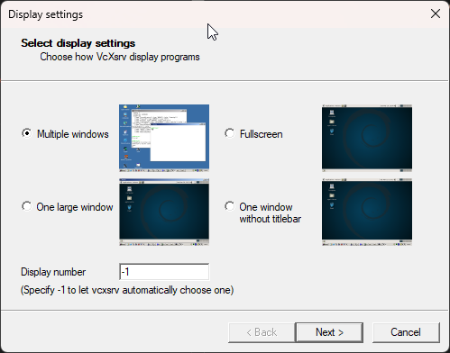
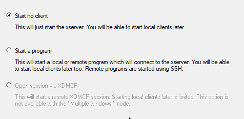
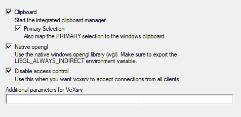
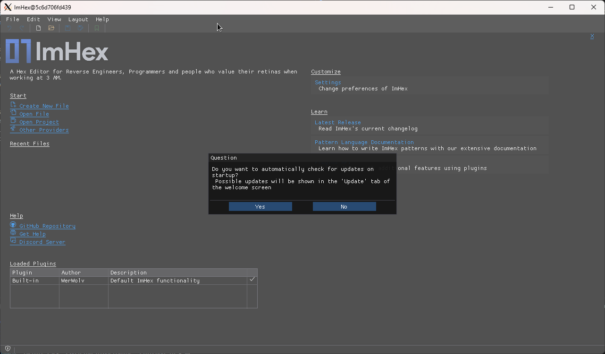
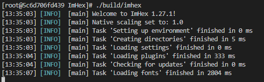

You can develop using Docker, GUI included.

`cd dist`
`docker build -t imhex .` # this will build an image called imhex

For GUI, you will need to install an X Server on your host machine. I recommend [VcXsrv ]([VcXsrv](https://sourceforge.net/projects/vcxsrv/))

Then you'll need to find your local IP address. You can do this by running `ipconfig` or `ip addr` on most Linux distros. You'll need to use this IP address in the next step.

```ps
Set-Variable -name DISPLAY -value <YOUR_LOCAL_IP>:0.0
docker run -ti --rm -e DISPLAY=$DISPLAY imhex
```

Next open `VcXsrv` and configure it according to these screenshots:










Now, inside the container run `./build/imex` and you should see this:



You're all set.
