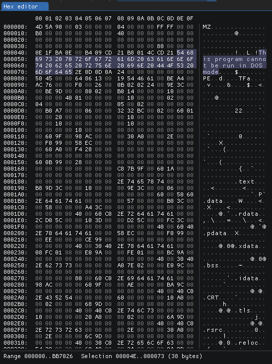

Hex Editor
==========

The Hex Editor is ImHex's main view. It displays the content of the current data source in hexadecimal notation but interacts a lot with other parts of ImHex as well.

Selecting Bytes
---------------

Bytes can be selected by clicking on them with the mouse. To select multiple bytes, click and drag the mouse over the hex editor view from the first byte in the desired selection to the last byte.

* If a byte is already selected, the ``Arrow Keys`` can be used to move the selection around. When holding down ``SHIFT``, the currently selected byte will be used as the start position of a selection and every byte up to the new cursor position will be selected.
* Using ``Page Up`` and ``Page Down`` moves the cursor up and down an entire page.
* ``Escape`` revokes the current selection.
* ``Home`` moves the cursor to the first byte and ``End`` moves it to the last byte.

Editing Bytes
-------------

When the current data source is not read-only, bytes can be edited by double clicking them and then entering a new value in hexadecimal. This action will automatically create a new patch and not edit the loaded file until saved.

