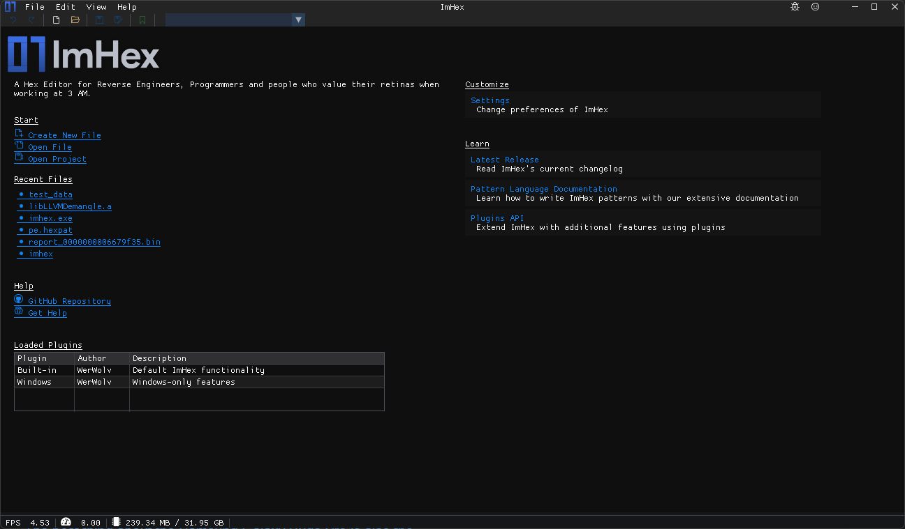

Welcome Screen
==============

The welcome screen is the first screen displayed when opening ImHex. It allows opening files, create new files and access a variaty of information sources. 

Start
-----

The start section has the following options:

* Create New File
    * Creates a new, empty file at the specified location and opens it.
* Open File
    * Opens an existing file
* Open Project
    * Opens an existing project file which can contain patches, pattern language source code, bookmarks, data processor nodes and more.

Recent Files
------------

Up to six recently opened files are displayed here and can be opened immediately.

Help
----

Links to the GitHub Repository and the GitHub Discussions page to find information and get help.

Loaded Plugins
--------------

All currently loaded plugins. When more third-party plugins got loaded, they will show up here.

Customize
---------

Easy access to the settings page

Learn
-----

* Latest Release
    * Link to ImHex's latest release page to read the current changelog or download a new version
* Pattern Language documentation
    * Link to this page to learn about how to write patterns
* Plugins API
    * Link to the Plugins API documentation