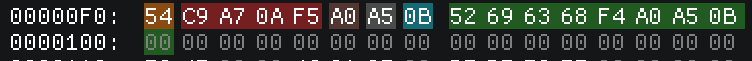
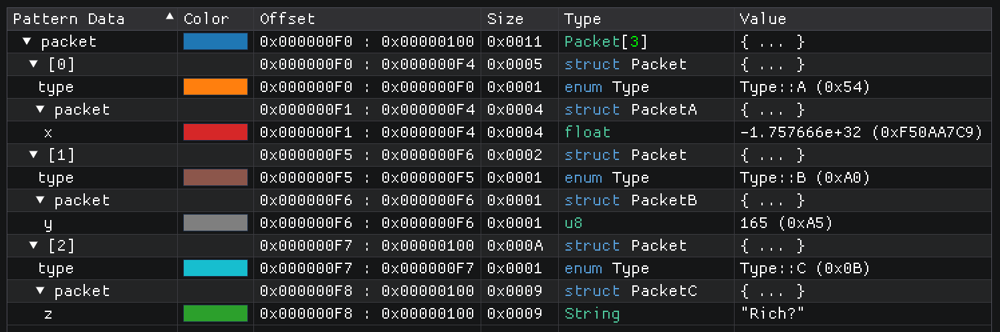

Conditionals
============

In the pattern language, not all structs need to be the same size or have the same layout. It's possible to
change what variables are getting declared based on the value of other variables.

.. code-block:: hexpat

    enum Type : u8 {
        A = 0x54,
        B = 0xA0,
        C = 0x0B
    };

    struct PacketA {
        float x;
    };

    struct PacketB {
        u8 y;
    };

    struct PacketC {
        char z[];
    };

    struct Packet {
        Type type;
        
        if (type == Type::A) {
            PacketA packet;
        }
        else if (type == Type::B) {
            PacketB packet;
        }
        else if (type == Type::C)
            PacketC packet;
    };

    Packet packet[3] @ 0xF0;

This code looks at the first byte of each ``Packet`` to determine its type so it can decode the body of the packet accordingly using the correct types defined in ``PacketA``, ``PacketB`` and ``PacketC``.

