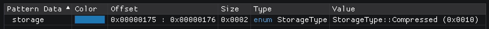
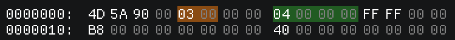
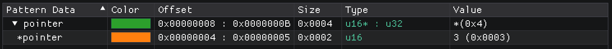
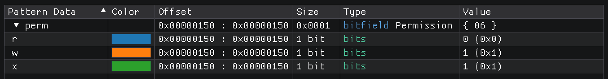
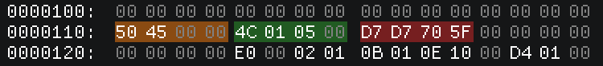
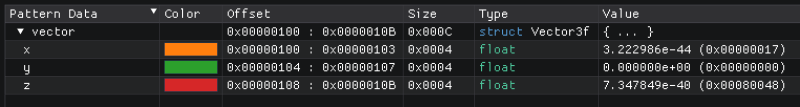
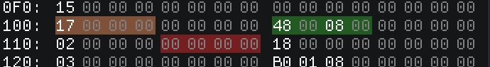

Data Types
==========

Types are the fundamental entity defining how a certain region of memory should be interpreted, formatted and displayed.

Built-in Types
^^^^^^^^^^^^^^

The simplest available types are the built-in standard types:

.. table::
    :align: left

    ======== ==========
    Unsigned Integers
    -------------------
    Name     Size   
    ======== ==========
    ``u8``   1 Byte
    ``u16``  2 Bytes
    ``u32``  4 Bytes
    ``u64``  8 Bytes
    ``u128`` 16 Bytes
    ======== ==========

.. table::
    :align: left

    ======== ==========
    Signed Integers
    -------------------
    Name     Size   
    ======== ==========
    ``s8``   1 Byte
    ``s16``  2 Bytes
    ``s32``  4 Bytes
    ``s64``  8 Bytes
    ``s128`` 16 Bytes
    ======== ==========

.. table::
    :align: left

    ========== ==========
    Floating Point
    ---------------------
    Name       Size   
    ========== ==========
    ``float``  4 Bytes
    ``double`` 8 Bytes
    ========== ==========

.. table::
    :align: left

    ========== ==========
    Special
    ---------------------
    Name       Size   
    ========== ==========
    ``char``   1 Bytes
    ``char16`` 2 Bytes
    ``bool``   1 Byte
    ``str``    Varying
    ``auto``   Varying
    ========== ==========

* Unsigned integer types are displayed as a number ranging from ``0`` to ``((1 << bits) - 1)``.
* Signed integer types are displayed in decimal as a number in Two's complement ranging from ``-(1 << (bits - 1))`` to ``(1 << (bits - 1)) - 1``
* Floating point types are displayed according to ``IEEE 754``
* ``char`` is displayed as a ``ASCII`` character.
* ``char16`` is displayed as a ``UTF-16`` character.
* ``bool`` is displayed as ``false`` for the value zero, ``true`` for the value one and ``true*`` for any other value
* ``str`` can only be used for passing strings as function parameter. Use ``char[]`` instead in custom types.
* ``auto`` can only be used for function parameters and automatically resolve to whatever type is passed into the function. :version:`1.10.1`

Endianess
^^^^^^^^^

By default all built-in types are interpreted in native endianess. 
Meaning if ImHex is running on a little endian machine, all types will be treated as little endian. On a big endian machine they will be treated as big endian.

However it's possible to override this default on a global, per-type or per-variable basis.
Simply prefix any type with the ``le`` for little endian or ``be`` for big endian keyword:

.. code-block:: hexpat

    le u32 myUnsigned;  // Little endian 32 bit unsigned integer
    be double myDouble; // Big endian 64 bit double precision floating point
    s8 myInteger;       // Native endian 8 bit signed integer

Literals
^^^^^^^^

Literals are fixed values representing a specific constant. The following literals are available:

.. table::
    :align: left

    =========================== ===========================
    Type                        Example   
    =========================== ===========================
    Decimal Integer             ``42``, ``-1337``
    Unsigned 32 bit integer     ``69U``
    Signed 32 bit integer       ``69``, ``-123``
    Hexadecimal Integer         ``0xDEAD``
    Binary Integer              ``0b00100101``
    Octal Integer               ``0o644``
    Float                       ``1.414F``
    Double                      ``3.14159``, ``1.414D``
    Boolean                     ``true``, ``false``
    Character                   ``'A'``
    String                      ``"Hello World"``
    =========================== ===========================

Enums
^^^^^

Enums are datatypes that consist of a set of named constants of a specific size. 

They are particularly useful for associating meaning to a value found in memory.
Defining an enum works similar to other C-like languages. The first entry in the enum will be associated the value ``0x00`` and each following one will count up from there.
If an entry has an explicit value assigned to it, every entry following it will continue counting from there.

.. code-block:: hexpat

  enum StorageType : u16 {
    Plain,    // 0x00
    Compressed = 0x10,
    Encrypted // 0x11
  };

The type following the colon after the enum name declares the enum's underlying type and can be any built-in datatype.
This type only affects the enum's size.

Arrays
^^^^^^

Arrays are a contiguous collection of one or more value of the same type.

Constant sized array
--------------------

A contant size can be specified by entering the number of entries in the square brackets. This value may also name another variable which will be read to get the size.

.. code-block:: hexpat

  u32 array[100] @ 0x00;

Unsized array
-------------

It's possible to leave the size of the array empty in which case it will keep on growing until it hits an entry which is all zeros.

.. code-block:: hexpat

  char string[] @ 0x00;

Loop sized array
----------------

Sometimes arrays need to keep on growing as long as a certian condition is met. The following array will grow until it hits a byte with the value ``0xFF``.

.. code-block:: hexpat

  u8 string[while(std::mem::read_unsigned($, 1) != 0xFF)] @ 0x00;

Optimized arrays
----------------

Big arrays take a long time to compute and take up a lot of memory. Because of this, arrays of built-in types are automatically optimized to only create one instance of the
array type and move it around accordingly.

The same optimization can be used for custom types by marking them with the ``[[static]]`` attribute. However this can only be done if the custom type always has the same size and same memory layout. Otherwise results may be invalid!

Strings
-------

``char`` and ``char16`` types act differently when they are used in an array.
Instead of displaying as an array of characters, they are displayed as a String instead; terminated by a null byte in the following example.

.. code-block:: hexpat

    char myCString[];
    char16 myUTF16String[];

Pointers
^^^^^^^^

Pointers are variables that treat their value as an address to find the address of the value they are pointing to.

.. code-block:: hexpat

    u16 *pointer : u32 @ 0x08;

This code declares a pointer whose address is a ``u32`` and points to a ``u16``.

The address will always be treated as absolute. Make sure to set the base address of your data correctly in order for pointers to work as intended.

Using declarations
^^^^^^^^^^^^^^^^^^

Using declarations are useful to give existing types a new name and optionally add extra specifiers to them.
The following code creates a new type called ``Offset`` which is a big endian 32 bit unsigned integer. It can be used in place of any other type now.

.. code-block:: hexpat

    using Offset = be u32;

Bitfields
^^^^^^^^^

Bitfields are similar to structs but they address individual, unaligned bits instead. 
They can be used to decode bit flags or other types that use less than 8 bits to store a value.

.. code-block:: hexpat

  bitfield Permission {
    r : 1;
    w : 1;
    x : 1;
  };

Each entry inside of a bitfield consists of a field name followed by a colon and the size of the field in bits.
A single field cannot occupy more than 64 bits.

Padding :version:`1.12.0`
-------------------------

It's also possible to insert padding inbetween fields using the padding syntax.

.. code-block:: hexpat

  bitfield Flags {
    a : 1;
    b : 2;
    padding : 4;
    c : 1;
  };

This inserts a 4 bit padding between field ``b`` and ``c``.

Structs
^^^^^^^

Structs are data types that bundle multiple variables together into one single type.

A very simple struct for a 3D vector of floats might look like this:

.. code-block:: hexpat

  struct Vector3f {
    float x, y, z;
  };

Placing it into memory using the placement syntax will place all members of the struct directly adjacent to each other starting at the specified address.

Padding
-------

By default there's no padding between struct members. This is not always desired so padding can be inserted manually if needed using the ``padding`` keyword.

.. code-block:: hexpat

  struct Vector3f {
    float x;
    padding[4];
    float y;
    padding[8];
    float z;
  };

This code will insert a 4 byte padding between the members ``x`` and ``y`` as well as a 8 byte padding between ``y`` and ``z``.
  

Inheritance :version:`1.10.1`
-----------------------------

Inheritance allows copying all members of the parent struct into the child struct and make them available there.

.. code-block:: hexpat

  struct Parent {
    u32 type;
    float value;
  };

  struct Child : Parent {
    char string[];
  };

The struct ``Child`` now contains ``type``, ``value`` and ``string``.

Conditional parsing
-------------------

The ImHex pattern language provides advanced features that allow for much more complex struct definitions, these features are detailed on the :doc:`Control flow </pattern_language/control_flow>` page.

Unions
^^^^^^

Unions are similar to structs in that they bundle multiple variables together into a new type, however instead of these variables being placed consequitive, they all share the same start address.

This can be useful to interpret and inspect data as multiple different types as shown here:

.. code-block:: hexpat

  union Converter {
    u32 integerData;
    float floatingPointData;
  };

.. image:: assets/unions/hex.png
  :width: 100%
  :alt: Unions Highlighing

.. image:: assets/unions/data.png
  :width: 100%
  :alt: Unions Decoding
