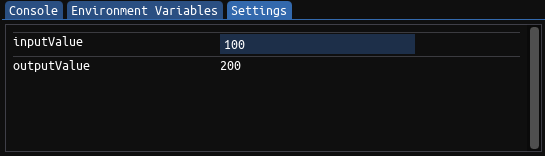

In / Out Variables :version:`1.13.0`
====================================

In and Out variables are a way to pass config or input data into the pattern and read result data back out from the pattern.

Each ``in`` and ``out`` variable creates an entry in the Settings tab of the Pattern Editor view. 
``in`` variables create a input field, ``out`` variables create a label.

Before executing the pattern, the user can now enter a value in the input field of the ``in`` variable. This value will be copied into the
corresponding ``in`` variable before the pattern is executed.

Likewise, once the pattern has finished executing, whatever value has been written to the ``out`` variable will be displayed in the label.

The following code shows a simple pattern that reads in the value of ``inputValue``, multiplies it by two and then writes it back into ``outputValue``.

.. code-block:: hexpat

    u32 inputValue in;
    u32 outputValue out;

    fn main() {
        outputValue = inputValue * 2;
    };

