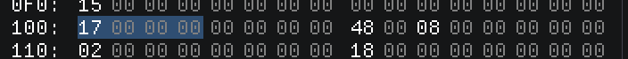
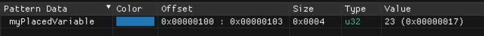

Variable Placement
==================

In order for ImHex to start highlighing variables and display them in the pattern data table, they need to be placed
somewhere in the binary data. To do this the variable placement syntax is used:

.. code-block:: hexpat

    u32 myPlacedVariable @ 0x110;

This creates a new unsigned 32 bit variable named ``myPlacedVariable`` and place it at address ``0x100``.

ImHex will now highlight and treat the 4 bytes starting at offset ``0x100`` as a u32 and displays it in the pattern data table.

Placing variables isn't limited to just built-in types. All types, even custom ones like structs, enums, unions, etc, can be placed.
It's the entry point for any structure parsing in ImHex.

Global variables :version:`1.11.0`
----------------------------------

Sometimes it's necessary to store data globally while the pattern is running. For this global variables can be used.
The syntax is the same as with placed variables but are missing the `@` placement instruction at the end.

.. code-block:: hexpat

    u32 globalVariable;