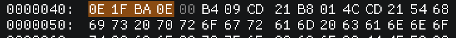
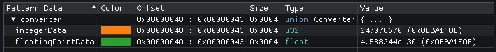

Unions
======

Unions are similar to structs in that they bundle multiple variables together into a new type, however instead of these variables being placed consequitive, they all share the same start address.

This can be useful to interpret and inspect data as multiple different types as shown here:

.. code-block:: hexpat

  union Converter {
    u32 integerData;
    float floatingPointData;
  };

